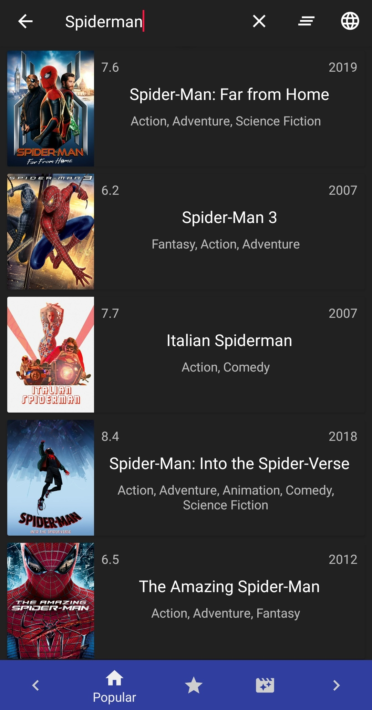

# Application MovieDB
## Présentation

MovieDB est une application démontrant l'utilisation du MVC en appelant un API REST ([TheMovieDB](https://www.themoviedb.org/documentation/api)) dans une application android codé en Java sous Android Studio. Cette application vous listera les films populaires, les meilleurs notés et ceux à venir. Vous pouvez également en apprendre plus

## Prérequis

 1. Avoir Android Studio installé ou un IDE de votre choix
 2. Récupérer la branche prod du lien ci-dessous
 [Link GitHub](https://github.com/SasiGovind/MovieDB.git)

## Consignes respectées :

 1. Appel à une API Rest pour récupérer des données.
 2. Deux écrans : un écran avec une liste et un écran avec un détail de l'item.
 3. Stockage des données en cache (de toutes les données chargées).
 4. Architecture ModelViewControler(MVC).
 5. GitFlow
 7. Design Patterns : Singleton, Adapter, Builder
 8. Injection de dépendances
 9. Animation entre écrans 2 points (SharedElements)
 10. Utilisation de Fragment

## Autres Fonctionnalités : 

### Fonctions communes :
1. Design et couleurs personnalisés
2. Application icône personnalisé 

3. Lancement de l'application : écran de chargement animé

### Movie List Activity (1er Ecran) :

 1. Bottom Navigation View + 3 listes consultables (film populaire, meilleurs notes, à venir)
 
   
 
 2. Navigation de pages (flèches sur le Bottom Navigation View)
 
 
 3. Recherche de films améliorée (icon 'loupe' en haut à droite)
 
 4. Choix de langues (icon 'language' en haut à droite) 
 5. Nettoyer le cache (icon 'clear_all' en haut à droite)
 6. Tirer pour recharger la page
   
 
 7. Sélection de genres de films à afficher
 
 
 8. AlertDialog de confirmation lorsque l'utilisateur quitte l'application
 
 9. Affichage de la page chargée en Toast

### Movie Detail List Activity (2ème Ecran) :

 1. Toucher le poster du film pour zoomer l'affiche.
 
   
 
 2. Separateur entre les différents éléments affichés.
  
 3. Option de recherche sur google du film (icon 'loupe' en haut à droite de l'écran)
  
 4. Option de partage (icon 'share' en haut à droite de l'écran) : permet de partager les informations du film à quelqu'un.
  
 5. Effet CollapsingToolbarLayout pour la bannière & l'effet du poster flottant.
 6. Option de recherche de cast sur google : en cliquant sur un membre du cast.
    
 7. Possibilité de visionner les bandes d'annonces des films.
    
 8. Affichage de films similaires au film sélectioné.
 
  
### People Activity (3ème Ecran) :
 Contient le fragment people.
  
 
### Librairies :
 - Retrofit
 - Glide
 - Gson
 - RecyclerView
 - CardView
 - Fragment
 - Design
# Application MovieDB
## Présentation

MovieDB est une application démontrant l'utilisation du MVC en appelant un API REST ([TheMovieDB](https://www.themoviedb.org/documentation/api)) dans une application android codé en Java sous Android Studio. Cette application vous listera les films populaires, les meilleurs notés et ceux à venir. Vous pouvez également en apprendre plus

## Prérequis

 1. Avoir Android Studio installé ou un IDE de votre choix
 2. Récupérer la branche prod du lien ci-dessous
 [Link GitHub](https://github.com/SasiGovind/MovieDB.git)

## Consignes respectées :

 1. Appel à une API Rest pour récupérer des données.
 2. Deux écrans : un écran avec une liste et un écran avec un détail de l'item.
 3. Stockage des données en cache (de toutes les données chargées).
 4. Architecture ModelViewControler(MVC).
 5. GitFlow
 7. Design Patterns : Singleton, Adapter, Builder
 8. Injection de dépendances
 9. Animation entre écrans 2 points (SharedElements)
 10. Utilisatoin de Fragment

## Autres Fonctionnalités : 

### Fonctions communes :
1. Design et couleurs personnalisés
2. Application icône personnalisé 

3. Lancement de l'application : écran de chargement animé

### Movie List Activity (1er Ecran) :

 1. Bottom Navigation View + 3 listes consultables (film populaire, meilleurs notes, à venir)
 
   
 
 2. Navigation de pages (flèches sur le Bottom Navigation View)
 
 
 3. Recherche de films améliorée (icon 'loupe' en haut à droite)
 
 4. Choix de langues (icon 'language' en haut à droite) 
 5. Nettoyer le cache (icon 'clear_all' en haut à droite)
 6. Tirer pour recharger la page
   
 
 7. Sélection de genres de films à afficher
 
 
 8. AlertDialog de confirmation lorsque l'utilisateur quitte l'application
 

 9. Affichage de la page chargée en Toast

### Movie Detail List Activity (2ème Ecran) :

 1. Toucher le poster du film pour zoomer l'affiche.
 
   
 
 2. Separateur entre les différents éléments affichés.
  
 3. Option de recherche sur google du film (icon 'loupe' en haut à droite de l'écran)
  
 4. Option de partage (icon 'share' en haut à droite de l'écran) : permet de partager les informations du film à quelqu'un.
  
 5. Effet CollapsingToolbarLayout pour la bannière & l'effet du poster flottant.
 6. Option de recherche de cast sur google : en cliquant sur un membre du cast.
    
 7. Possibilité de visionner les bandes d'annonces des films.
    
 8. Affichage de films similaires au film sélectioné : 
 - En cliquant sur un film similaire : on accède à la fiche du film choisit.
 
  
### People Activity (3ème Ecran) :
 Contient le fragment people : on peut faire une recherche internet de la célébrité avec le button en bas à droite du fragment 
  
 
### Librairies :
 - Retrofit
 - Glide
 - Gson
 - RecyclerView
 - CardView
 - Fragment
 - Design
